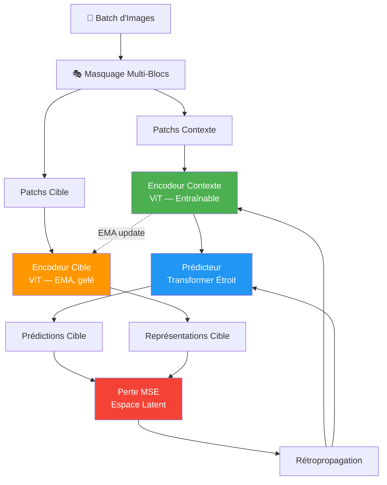

<p align="center">
  
  
  
  
</p>

<h1 align="center">🧠 I-JEPA</h1>
<h3 align="center">Image Joint Embedding Predictive Architecture</h3>

<p align="center">
  <em>Implémentation complète en PyTorch de l'architecture I-JEPA de Meta AI (FAIR)</em>
</p>

<p align="center">
  <strong>📄 Paper :</strong> Assran et al., <em>"Self-Supervised Learning from Images with a Joint-Embedding Predictive Architecture"</em>, CVPR 2023
</p>

---

## 📋 Table des Matières

- [Présentation du Projet](#-présentation-du-projet)
- [Architecture I-JEPA](#-architecture-i-jepa)
- [Structure du Projet](#-structure-du-projet)
- [Installation](#-installation)
- [Utilisation](#-utilisation)
- [Détails Techniques des Modules](#-détails-techniques-des-modules)
- [Configuration](#-configuration)
- [Résultats Attendus](#-résultats-attendus)
- [I-JEPA vs Autres Méthodes SSL](#-i-jepa-vs-autres-méthodes-ssl)
- [Conseils GPU & Mémoire](#-conseils-gpu--mémoire)
- [Références](#-références)

---

## 🎯 Présentation du Projet

**I-JEPA** (Image Joint Embedding Predictive Architecture) est une méthode d'apprentissage auto-supervisé (Self-Supervised Learning — SSL) développée par Meta AI. Contrairement aux méthodes classiques, I-JEPA apprend des représentations visuelles **sémantiques** sans jamais reconstruire les pixels de l'image.

### 💡 Idée Clé

> Au lieu de prédire les pixels manquants (comme MAE), I-JEPA prédit les **représentations latentes** des patchs masqués. Cela force le modèle à capturer des caractéristiques **sémantiques de haut niveau** plutôt que des textures de bas niveau.

### Pourquoi I-JEPA ?

| Caractéristique | Avantage |
|---|---|
| 🧩 Prédiction en espace latent | Représentations sémantiques riches |
| 🔄 Pas d'augmentations lourdes | Pas besoin de color jittering, blur, etc. |
| 🎯 Masquage multi-blocs | Encourage le raisonnement spatial |
| ⚡ Architecture efficace | Prédicteur étroit → moins de paramètres |
| 🛡️ EMA pour la stabilité | Prévention de l'effondrement des représentations |

---

## 🏗️ Architecture I-JEPA

```
┌─────────────────────────────────────────────────────────────────────────────┐
│                          I-JEPA ARCHITECTURE                               │
│                                                                             │
│   Image d'Entrée                                                            │
│   ┌──────────────┐                                                          │
│   │ ▓▓░░░░▓▓▓▓▓▓ │  ▓ = Patchs contexte (visibles)                         │
│   │ ▓▓░░░░▓▓▓▓▓▓ │  ░ = Patchs cible (masqués)                             │
│   │ ▓▓▓▓▓▓▓▓░░░░ │                                                          │
│   │ ▓▓▓▓▓▓▓▓░░░░ │  Masquage multi-blocs : 4 blocs cibles                  │
│   └──────┬───────┘                                                          │
│          │                                                                  │
│    ┌─────┴─────┐              ┌──────────────┐                              │
│    │  Patchs   │              │   Patchs     │                              │
│    │  Contexte │              │   Cibles     │                              │
│    └─────┬─────┘              └──────┬───────┘                              │
│          │                           │                                       │
│          ▼                           ▼                                       │
│  ┌─────────────────┐       ┌─────────────────┐                              │
│  │  ENCODEUR        │       │  ENCODEUR        │                              │
│  │  CONTEXTE        │       │  CIBLE           │  ◄── Copie EMA (pas de grad) │
│  │  (ViT, 6 blocs)  │       │  (ViT, 6 blocs)  │                              │
│  │  Entraînable ✓   │       │  Gelé (EMA) ✗    │                              │
│  └─────────┬────────┘       └────────┬─────────┘                              │
│            │                         │                                       │
│            │    ┌──────────────┐     │                                       │
│            ├───►│ PRÉDICTEUR   │     │ Représentations cibles                │
│            │    │ (3 blocs)    │     │ (vérité terrain)                       │
│            │    │ Étroit ↕     │     │                                       │
│            │    └──────┬───────┘     │                                       │
│            │           │             │                                       │
│            │           ▼             ▼                                       │
│            │    ┌───────────────────────────┐                                │
│            │    │       PERTE MSE           │  ◄── Dans l'ESPACE LATENT      │
│            │    │   (espace d'embeddings)   │      PAS dans l'espace pixel ! │
│            │    └───────────────────────────┘                                │
│                                                                             │
│   ════════════════════════════════════════                                   │
│   DIFFÉRENCE CLÉ AVEC MAE :                                                │
│     • MAE   : prédit des PIXELS    → features bas niveau                    │
│     • I-JEPA : prédit des EMBEDDINGS → features sémantiques                │
│   ════════════════════════════════════════                                   │
└─────────────────────────────────────────────────────────────────────────────┘
```

### Pipeline d'Entraînement (étape par étape)



### Formulation Mathématique

La fonction de perte I-JEPA est définie comme suit :

$$\mathcal{L} = \frac{1}{|M|} \sum_{i \in M} \left\| f_\theta(x_{\text{ctx}}, \text{pos}_i) - \text{sg}\left[g_\xi(x)_i\right] \right\|_2^2$$

Où :
- $f_\theta$ — Encodeur contexte + Prédicteur (entraînables)
- $g_\xi$ — Encodeur cible (mis à jour par EMA)
- $M$ — Ensemble des indices de patchs cibles (masqués)
- $x_{\text{ctx}}$ — Patchs contexte (visibles)
- $\text{sg}[\cdot]$ — Stop-gradient (pas de rétropropagation à travers l'encodeur cible)

**Mise à jour EMA de l'encodeur cible :**

$$\xi \leftarrow m \cdot \xi + (1 - m) \cdot \theta$$

Avec un schedule cosinus pour le momentum : $m : 0.996 \rightarrow 1.0$

---

## 📁 Structure du Projet

```
projet-jepa/
│
├── model/                          # 🧠 Composants du modèle
│   ├── __init__.py                 # Documentation du package
│   ├── encoder.py                  # Encodeur contexte (ViT entraînable)
│   ├── predictor.py                # Prédicteur (transformer étroit)
│   └── target_encoder.py           # Encodeur cible (EMA, pas de gradients)
│
├── data/                           # 📦 Chargement des données
│   ├── __init__.py                 # Documentation du package
│   └── dataset.py                  # Chargeurs STL-10 / CIFAR-10
│
├── utils/                          # 🔧 Utilitaires
│   ├── __init__.py                 # Documentation du package
│   ├── masking.py                  # Stratégie de masquage multi-blocs
│   └── ema.py                      # Moyenne mobile exponentielle (EMA)
│
├── train.py                        # 🚀 Boucle de pré-entraînement SSL
├── eval.py                         # 📊 Évaluation par sondage linéaire
├── visualize.py                    # 📈 t-SNE, cartes d'attention, courbes
├── config.yaml                     # ⚙️ Hyperparamètres
└── README.md                       # 📝 Ce fichier
```

---

## ⚙️ Installation

### Prérequis

- **Python** ≥ 3.8
- **GPU CUDA** recommandé (8 Go+ VRAM)

### Installer les Dépendances

```bash
pip install torch torchvision pyyaml numpy matplotlib scikit-learn
```

> **Note :** Aucune dépendance exotique — uniquement l'écosystème PyTorch et les bibliothèques scientifiques standard.

### Vérifier l'installation

```bash
python -c "import torch; print(f'PyTorch {torch.__version__} | CUDA: {torch.cuda.is_available()}')"
```

---

## 🚀 Utilisation

### 1. Pré-entraînement Auto-Supervisé I-JEPA

```bash
cd projet-jepa
python train.py
```

Ce script va :
- ✅ Télécharger STL-10 automatiquement (repli sur CIFAR-10 si nécessaire)
- ✅ Entraîner pendant 100 époques avec AdamW + schedule LR cosinus
- ✅ Sauvegarder les checkpoints toutes les 10 époques dans `./checkpoints/`
- ✅ Utiliser la précision mixte (AMP) pour accélérer l'entraînement

**Avec une configuration personnalisée :**
```bash
python train.py chemin/vers/config.yaml
```

### 2. Évaluation par Sondage Linéaire (Linear Probing)

```bash
python eval.py
```

Ce script va :
- 📥 Charger le dernier checkpoint
- 🔒 Geler les poids de l'encodeur
- 🎓 Entraîner un classifieur linéaire par-dessus
- 📊 Rapporter la précision top-1 sur le jeu de test

### 3. Génération des Visualisations

```bash
python visualize.py
```

Produit dans `./figures/` :

| Fichier | Description |
|---------|-------------|
| `tsne_representations.png` | Projection t-SNE des features — montre la qualité des clusters |
| `attention_maps.png` | Cartes d'attention de l'encodeur — montre les zones d'intérêt |
| `loss_curve.png` | Courbe de perte — montre la convergence de l'entraînement |

---

## 🔬 Détails Techniques des Modules

### `model/encoder.py` — Encodeur Contexte (ViT)

Le **Vision Transformer** entraînable qui encode **uniquement** les patchs visibles (contexte).

| Composant | Détails |
|---|---|
| `PatchEmbedding` | Projection Conv2D → embeddings de patchs |
| `MultiHeadSelfAttention` | Attention multi-tête avec produit scalaire |
| `TransformerBlock` | Pre-LN → MHSA → résidu → Pre-LN → MLP → résidu |
| `VisionTransformerEncoder` | Architecture complète avec embeddings positionnels sinusoïdaux 2D |

**Spécifications :**
- Architecture : ViT-Small (6 blocs, dim=384, 6 têtes)
- Taille de patch : 8×8 → grille 12×12 = 144 patchs
- Activation : GELU
- Initialisation : Xavier uniform
- Embeddings positionnels : sinusoïdaux 2D (non appris)

### `model/predictor.py` — Prédicteur

Le **transformer étroit** qui prédit les représentations des patchs cibles à partir des encodages contexte.

| Composant | Détails |
|---|---|
| `input_proj` | Projection linéaire : dim encodeur (384) → dim prédicteur (192) |
| `mask_token` | Token masque apprenable pour les positions cibles |
| `PredictorBlock` | Blocs transformer avec dimension réduite |
| `output_proj` | Projection linéaire : dim prédicteur (192) → dim encodeur (384) |

**Pourquoi étroit ?** Le prédicteur est volontairement plus petit que l'encodeur (192 vs 384) pour empêcher l'apprentissage d'une correspondance identité triviale. Si le prédicteur avait la même capacité, il pourrait mémoriser les sorties de l'encodeur cible sans que l'encodeur contexte n'apprenne des représentations utiles.

### `model/target_encoder.py` — Encodeur Cible (EMA)

La **copie EMA** de l'encodeur contexte qui fournit les représentations cibles (vérité terrain).

- 🔒 **Aucun gradient** ne passe à travers cet encodeur
- 🔄 Mis à jour uniquement via EMA : `θ_cible = m × θ_cible + (1-m) × θ_contexte`
- 👁️ Voit **TOUS** les patchs (pas de masquage) pour produire les cibles
- 📈 Le momentum suit un schedule cosinus : 0.996 → 1.0

### `utils/masking.py` — Masquage Multi-Blocs

La stratégie de masquage spécifique à I-JEPA.

**Algorithme :**
1. Échantillonner 4 **blocs rectangulaires** cibles (15-20% chacun)
2. Union de tous les indices cibles → patchs à prédire
3. Contexte = tous les patchs **non** dans les blocs cibles
4. Sous-échantillonnage optionnel du contexte (85-100%)

**Différence vs MAE :** MAE masque des patchs **individuels aléatoires** ; I-JEPA masque des **blocs contigus**, ce qui encourage le raisonnement spatial.

### `utils/ema.py` — Moyenne Mobile Exponentielle

- `ema_update()` : Mise à jour in-place des paramètres cibles
- `cosine_momentum_schedule()` : Schedule cosinus du momentum (0.996 → 1.0)

### `data/dataset.py` — Chargement des Données

Gère le chargement de STL-10 (préféré) et CIFAR-10 (repli).

**Augmentations minimales** (contrairement aux méthodes contrastives) :
- Random crop avec padding
- Random horizontal flip
- Normalisation ImageNet

> I-JEPA n'a **pas besoin** d'augmentations lourdes (color jittering, Gaussian blur, solarization) car il apprend par **prédiction**, pas par **invariance**.

### `train.py` — Boucle d'Entraînement

Pipeline complet de pré-entraînement auto-supervisé :

```
Pour chaque batch :
  1. Générer les masques multi-blocs
  2. Encodeur contexte : encoder les patchs visibles
  3. Prédicteur : prédire les représentations cibles
  4. Encodeur cible (EMA) : produire les cibles
  5. Perte MSE en espace latent
  6. Rétropropagation (encodeur contexte + prédicteur)
  7. Mise à jour EMA de l'encodeur cible
```

Fonctionnalités : warmup linéaire, decay cosinus du LR, gradient clipping, précision mixte (AMP), sauvegarde périodique.

### `eval.py` — Sondage Linéaire

Évalue la qualité des représentations apprises :
1. Charger l'encodeur pré-entraîné et **geler** ses poids
2. Ajouter une couche linéaire unique (384 → 10 classes)
3. Entraîner uniquement cette couche avec SGD + CrossEntropy
4. Rapporter la précision top-1

### `visualize.py` — Visualisations

Trois types de visualisations :
- **t-SNE** : réduction de dimension des features → qualité des clusters
- **Cartes d'attention** : heatmaps de la dernière couche → zones d'intérêt
- **Courbe de perte** : convergence avec lissage → stabilité de l'entraînement

---

## ⚙️ Configuration

Tous les hyperparamètres sont dans [`config.yaml`](config.yaml) :

| Paramètre | Valeur | Description |
|---|---|---|
| **Encodeur** | ViT-Small | patch=8, dim=384, depth=6, heads=6 |
| **Prédicteur** | Narrow ViT | dim=192, depth=3, heads=6 |
| **Taille image** | 96×96 | Résolution native STL-10 |
| **Patchs** | 12×12 = 144 | 96 / 8 = 12 |
| **Blocs cibles** | 4 | 15–20% chacun |
| **Momentum EMA** | 0.996 → 1.0 | Schedule cosinus |
| **Optimiseur** | AdamW | lr=1.5e-4, wd=0.05 |
| **Taille batch** | 256 | Réduire si OOM |
| **Époques** | 100 | ~45 min sur A100 |
| **AMP** | Activé | Précision mixte (FP16) |

---

## 📊 Résultats Attendus

### Précision du Sondage Linéaire (Top-1)

| Dataset  | Époques | Précision Attendue |
|----------|---------|---------------------|
| STL-10   | 100     | ~60–68%             |
| CIFAR-10 | 100     | ~70–78%             |

> **Note :** Ces résultats correspondent à un ViT-Small entraîné pendant 100 époques sur des datasets de petite échelle. Le papier original utilise un ViT-Huge sur ImageNet pendant 300+ époques, atteignant 70%+ en sondage linéaire et 83%+ en fine-tuning.

### Conseils pour de Meilleurs Résultats

- **Plus d'époques** : 300+ époques améliorent significativement la qualité
- **Plus grand batch** : 512 ou 1024 si la mémoire GPU le permet
- **Accumulation de gradients** : Simuler des batchs plus grands sur GPU plus petit
- **Modèle plus grand** : `embed_dim=768`, `depth=12` pour un ViT-Base

---

## ⚔️ I-JEPA vs Autres Méthodes SSL

### vs MAE (Masked Autoencoders)

| Aspect | MAE | I-JEPA |
|---|---|---|
| Cible de prédiction | Pixels bruts | Embeddings appris |
| Espace de la perte | Espace pixel | Espace latent |
| Décodeur | Décodeur pixel lourd | Prédicteur étroit |
| Encodeur cible | N/A | Encodeur EMA momentum |
| Augmentations | Fortes | Minimales |
| Qualité des features | Biaisées bas niveau | Sémantiques |

### vs Méthodes Contrastives (SimCLR, BYOL, DINO)

| Aspect | Contrastif | I-JEPA |
|---|---|---|
| Augmentations nécessaires | Lourdes (crop, color, blur) | Minimales |
| Type d'invariance | Aux augmentations | Au masquage |
| Signal d'entraînement | Niveau image | Niveau patch |
| Prévention du collapse | Négatifs / EMA / centrage | EMA + prédiction |

---

## 💾 Conseils GPU & Mémoire

Si vous rencontrez des erreurs **Out of Memory (OOM)** :

1. **Réduire la taille du batch** dans `config.yaml` :
   ```yaml
   training:
     batch_size: 128  # ou 64
   ```

2. **Désactiver AMP** si sur CPU :
   ```yaml
   training:
     use_amp: false
   ```

3. **Réduire la taille du modèle** :
   ```yaml
   encoder:
     embed_dim: 256  # au lieu de 384
     depth: 4        # au lieu de 6
   ```

---

## 📚 Références

```bibtex
@inproceedings{assran2023self,
  title     = {Self-Supervised Learning from Images with a Joint-Embedding
               Predictive Architecture},
  author    = {Assran, Mahmoud and Duval, Quentin and Misra, Ishan and
               Bojanowski, Piotr and Vincent, Pascal and Rabbat, Michael
               and LeCun, Yann and Ballas, Nicolas},
  booktitle = {CVPR},
  year      = {2023}
}
```

### Travaux Connexes

- **MAE** — He et al., *"Masked Autoencoders Are Scalable Vision Learners"*, CVPR 2022
- **BYOL** — Grill et al., *"Bootstrap Your Own Latent"*, NeurIPS 2020
- **DINO** — Caron et al., *"Emerging Properties in Self-Supervised Vision Transformers"*, ICCV 2021
- **MoCo v3** — Chen et al., *"An Empirical Study of Training Self-Supervised Vision Transformers"*, ICCV 2021

---

<p align="center">
  <em>Projet Deep Learning — Implémentation I-JEPA</em><br>
  <em>Ce projet est à des fins éducatives et de recherche.</em><br>
  <em>La méthode I-JEPA est développée par Meta AI (FAIR).</em>
</p>
